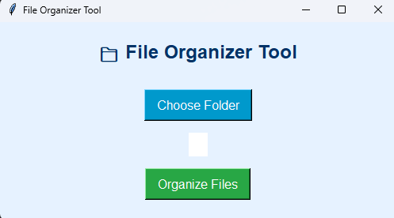

# 📁 File Organizer & Directory Automation Tool

[]
[]

> A simple yet powerful Python GUI tool to clean up and organize messy directories based on file types.

---

## ✨ Features

- 📂 Select any folder from your system
- 🧠 Automatically sorts files into subfolders like `Images`, `Documents`, `Videos`, etc.
- 🎨 Simple and vibrant UI built with Tkinter
- ⚙️ Uses built-in Python modules for seamless performance
- 📦 One-click automation for file management

---

## 🖥️ GUI Preview

---

## 🛠️ How It Works

1. Select a target folder using the GUI
2. The tool scans all files in that folder
3. Files are moved into subfolders based on file types:
    - `.jpg`, `.png` → `Images`
    - `.pdf`, `.docx` → `Documents`
    - `.mp4`, `.mov` → `Videos`
    - `.mp3`, `.wav` → `Music`
    - `.zip`, `.rar` → `Archives`
    - Unknown → `Others`

---

## 🧰 Technologies Used

- **Python**
- **Tkinter** (for GUI)
- **os** & **shutil** (for automation)

---

## 📂 Project Structure
📁 Downloads/
├── Images/
├── Documents/
├── Videos/
├── Music/
├── Archives/
└── Others/

---

## ⚙️ Setup Instructions

> ✅ Requires Python 3.8 or higher

### Step 1: Clone or Download the Project

You can manually download this project as a ZIP file and extract it.

Or, if using Git:
bash:
git clone https://github.com/AshleyMathias/File-Organizer-Tool.git
cd File-Organizer-Tool

### Step 2: Install Dependencies
pip install -r Requirments.txt

### Step 3: Run the Application
python main.py

---

###🙋‍♀️ About the Developer
Ashley Mathias
Python Developer & AI Enthusiast
Linkedin: ashleymathias10, Github: Ashley Mathias

---

  Built with 💻 and ☕ by <strong>Ashley Mathias</strong>

